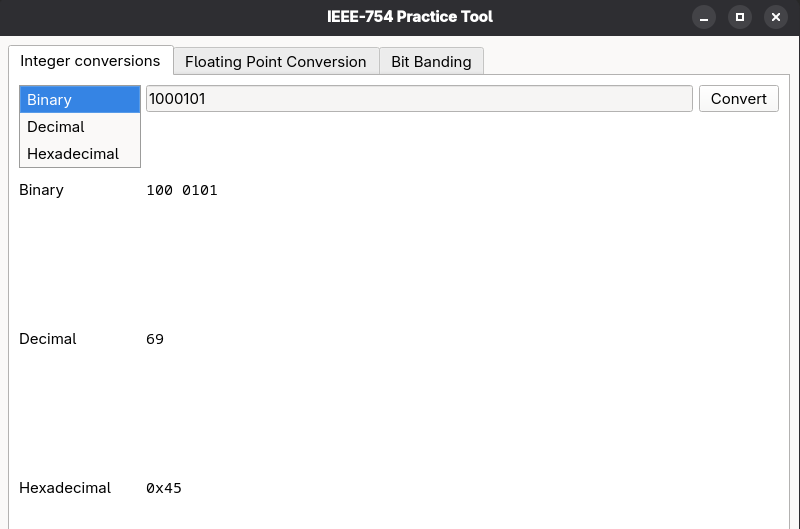
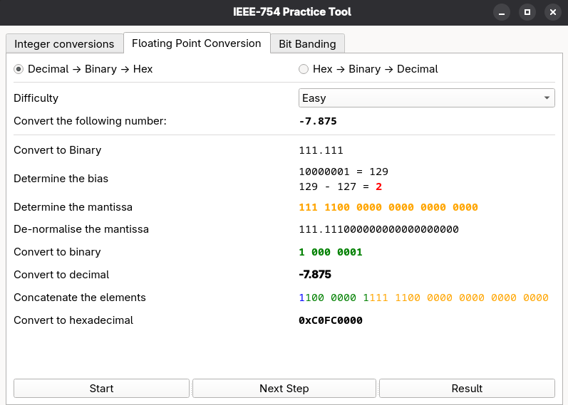
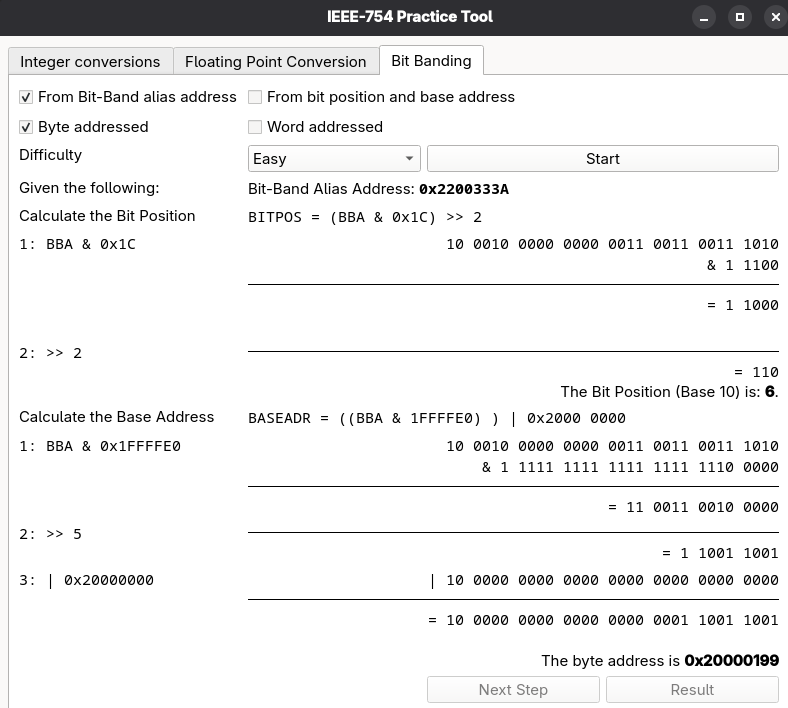

# ieee754-practice
A tool designed for people who wish to practice manual conversion of IEEE-754 floating point numbers and bit band aliasing.

## Integer Conversions
Shows integer numbers converted from and to any of base 2,10 or 12.

## Float Conversions
file '29-1.m4a'
Can be used to practice manual conversion to and from [IEEE-754 single precision floats](https://en.wikipedia.org/wiki/IEEE_754)

Offers step-by-step conversions of Decimal Numbers to binary and hexadecimal formats according to the IEEE-754 standard.
Also enables conversions of Hexadecimal Coded floats to decimal numbers.

## Bit Banding
Can be used to practice finding byte addresses from bit-band alias addresses.

